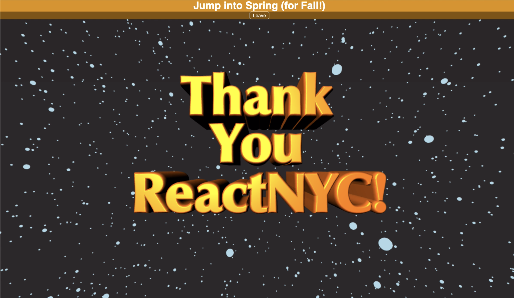

# React-Spring: Kickstart your Animation Experience!

Hi there! 👋 This repo includes all demo's referenced in my react-spring talk at the [React NYC Meetup](https://www.meetup.com/ReactNYC/) on Oct 7, 2019.

## How to use this repo

### Slide Deck: ([PDF](./slide-decks/React-Spring-Talk.pdf))

### The 'Sneak Peek' demo

- That great [tossing cards demo](https://codesandbox.io/embed/j0y0vpz59) was not mine, but it's a superb example to get excited about. Please check it out, along with the other demo's on the react-spring site.

### All other demos:

#### Run/tweak the code remotely on Code Sandbox (no git clone needed)

- Demo #1 - [Simple useSpring() Intro and walkthrough](https://codesandbox.io/s/react-spring-1-usespring-2tyi9)
- Demo #2 - [useSpring() applied twice](https://codesandbox.io/s/react-spring-2-usespring-compound-ql7tq)
- Demo #2.1 - [Simple Refactor for the useSprings() hook](https://codesandbox.io/s/react-spring-21-usesprings-gjcgu)
- Demo #3 - [useSprings() for a list](https://codesandbox.io/s/react-spring-3-usesprings-withlist-x28h8)
- Demo #4 - [Modal with useTransition()](https://codesandbox.io/s/react-spring-4-usetransition-modal-0ols9)
- Demo #5 - [React-Three-Fiber and React-Spring](https://codesandbox.io/s/react-spring-5-final-demo-1xquj)
  - Note: The react-three-fiber demo runs best on Chrome, the TextGeometry piece in particular is quite heavy to render!

#### React-Spring V9 (beta) Demos

- Notes:
  - The V8->V9 (beta) update is fairly straightforward for all hooks except for useTransition, which had important changes
  - Demos 4 and 5 have the changes for useTransition(). Many thanks to Alec Larson for assistance in working out issues.
- Demo #1 - [Simple useSpring() Intro and walkthrough](https://codesandbox.io/s/react-spring-1-usespring-v9-oioh9)
- Demo #2 - [useSpring() applied twice](https://codesandbox.io/s/react-spring-2-usespring-compound-v9-oqljo)
- Demo #2.1 - [Simple Refactor for the useSprings() hook](https://codesandbox.io/s/react-spring-21-usesprings-v9-w0gd7)
- Demo #3 - [useSprings() for a list](https://codesandbox.io/s/react-spring-3-usesprings-withlist-v9-kgc5y)
- Demo #4 - [Modal with useTransition()](https://codesandbox.io/s/react-spring-4-usetransition-modal-v9-ntmku)
- Demo #5 - [React-Three-Fiber and React-Spring](https://codesandbox.io/s/react-spring-5-final-demo-v9-c0y4s)

#### OR... Run the code locally

- Requirements

  - [NodeJS 10](https://nodejs.org/en/) for running
  - [Yarn](https://yarnpkg.com) for packaging
  - Suggested IDE is [VSCode](https://code.visualstudio.com), but any IDE should work

- To run

  - `git clone` the repo
  - `yarn install`
  - Run `yarn start` (this repo is built with create-react-app, so typical commands apply)

- SpringV9 Branch
  - React-Spring v9 is used in this branch to update all demos.
  - Note that Demo 5 is currently commented out due to an bug I'm working thru - The demo #5 for v9 on CodeSandbox above works fine at present.

### Links:

- Talks to see/read:

  - [Cheng Lou's react-europe talk introducing react-motion](https://youtu.be/1tavDv5hXpo)
  - [Christopher Chedeau's React-Rally 'animated' talk](https://speakerdeck.com/vjeux/react-rally-animated-react-performance-toolbox)
  - [Paul Henschel's blog on creating react-spring](https://blog.usejournal.com/why-react-needed-yet-another-animation-library-introducing-react-spring-8212e424c5ce)
  - [React-Spring Website](https://www.react-spring.io/)
  - [React-Three-Fiber github/docs](https://github.com/react-spring/react-three-fiber)
    - BONUS: Check out his brand new (and incredible) [examples page](http://react-three-fiber.surge.sh/#/)
  - Jason Lengstorf's **Learn with Jason** series
    - [Paul Henschel talks about React-three-fiber](https://youtu.be/1rP3nNY2hTo)
    - [Sarah Drasner talks about three.js](https://youtu.be/mXcawneCRHY)

- Folks to Follow:
  - Cheng Lou - @\_chenglou
  - Christopher Chedeau - @vjeux
  - Paul Henschel - @0xca0a
  - Sarah Drasner - @sarah_edo

### Special Thanks

- Thanks to [React NYC](https://www.meetup.com/ReactNYC/) for hosting and to everyone in attendance that night
- Thanks to [Paul Henschel](https://github.com/drcmda) for creating react-spring and react-three-fiber, along with everyone who create demo's and examples for it
- The mysterious [Mr Doob](https://mrdoob.com), wherever you are, for creating threejs

### Feedback / PR's

Feedback and PR's are welcome! Please add a star to this repo if you found this useful!

## Lastly...

Any ideas or feedback please feel free to reach out!

Copyright (c) 2019 Barry May (barry4dev@outlook.com)
